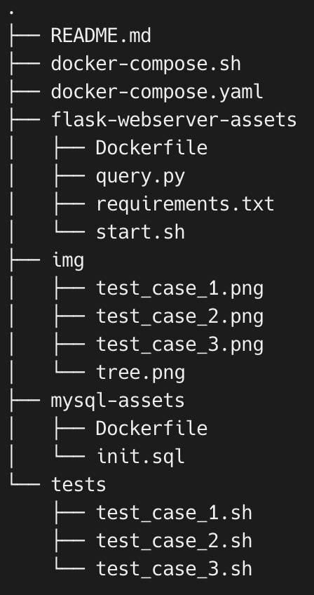
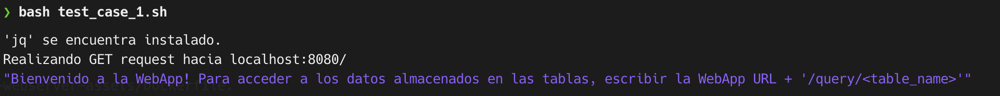
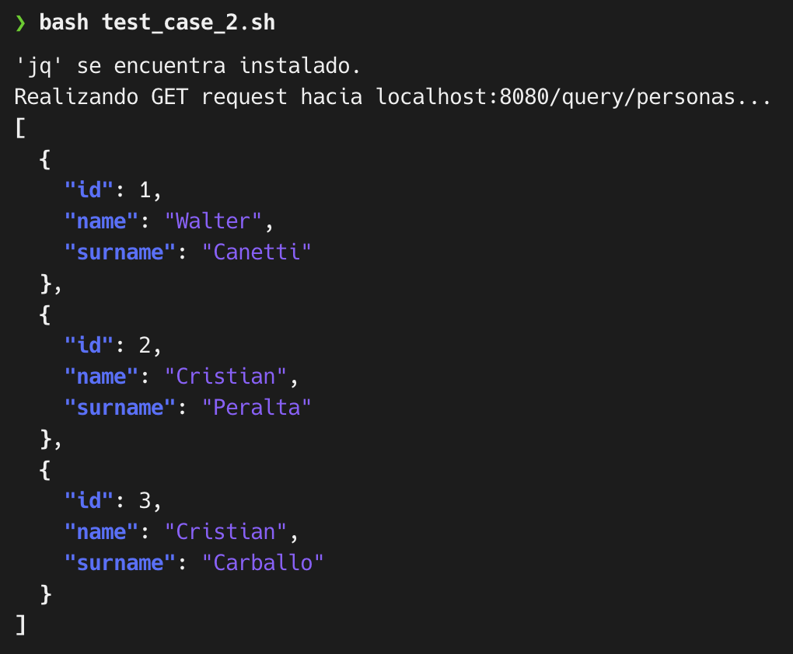
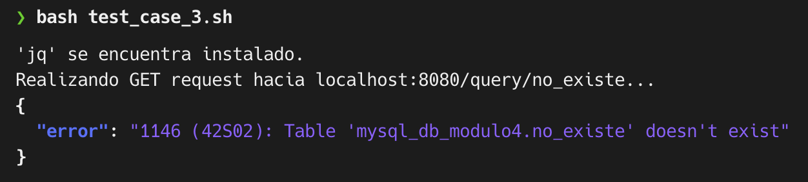

# Entrega 1 - Actividad Integradora Docker (Unidad 3)

---

## Descripción

Este proyecto es parte del curso **Docker y Kubernetes (2024)** de la **UTNBA**. En esta actividad, se ha creado un entorno utilizando Docker Compose que incluye un servidor Flask y una base de datos MySQL.

El script `docker-compose.sh` automatiza la construcción y el levantamiento de los contenedores que se especifican en el archivo `docker-compose.yaml`.

---

## Estructura del Proyecto



---

## Ejecución del Script

Para ejecutar el proyecto utilizando `docker-compose.sh`, realizar estos pasos:

1. Clonar este repositorio o descarga los archivos.

```bash
git clone https://github.com/criscarba/utn_kubernetes_999194250.git
cd utn_kubernetes_999194250/entregables/entregable-1-actividad-integradora-docker-unidad3	
```
2.	Docker y Docker Compose deben estar instalados en el sistema.

3.  Ejecuta el siguiente comando para iniciar los contenedores:

```bash
bash docker-compose.sh
```

---

## Explicación de ejecución

Este comando ejecutará los siguientes pasos:

1.	Construcción de Imágenes Docker:

    * Se construye una imagen Docker para el servidor Flask definido en flask-webserver-assets/Dockerfile.
    * Se construye una imagen Docker para la base de datos MySQL definida en mysql-assets/Dockerfile.
2.	Levantamiento de Contenedores:
    * El archivo docker-compose.yaml describe dos servicios:
        * Flask Webserver: Un servidor Python Flask que servirá una API sencilla para consultas.
        * MySQL: Una base de datos MySQL que será inicializada con el script init.sql.
3.	Configuración de Red y Volúmenes:
    * Los contenedores estarán conectados a una red de Docker personalizada.
    * Los datos de la base de datos se almacenarán en un volumen de Docker, lo que asegura la persistencia de los datos.
4.	Inicialización:
    * El contenedor de MySQL será inicializado con el archivo init.sql que contiene la estructura de base de datos inicial.
    * El servidor Flask estará accesible desde localhost en el puerto especificado en docker-compose.yaml.

---

## Archivos Clave

*   **docker-compose.sh**: Script que automatiza la ejecución de docker-compose.yaml.
*   **docker-compose.yaml**: Archivo de configuración de Docker Compose que define los servicios.
*   **flask-webserver-assets/Dockerfile**: Define la imagen del servidor Flask.
*   **mysql-assets/Dockerfile**: Define la imagen de la base de datos MySQL.
*   **mysql-assets/init.sql**: Script SQL que inicializa la base de datos con tablas o datos iniciales.

---

## Escenarios de pruebas
Fueron planteados los siguientes 3 escenarios de prueba.
Navegar primero hacia la carpeta de los escenarios de prueba con el siguiente comando:

```bash
cd utn_kubernetes_999194250/entregables/entregable-1-actividad-integradora-docker-unidad3/tests	
```

1.  Realizar un GET request hacia **localhost:8080/** sin especificar parametros
    
    * Este caso de prueba simplemente mostrará un placeholder de la WebApp indicando como debe realizarse debidamente un request
    
            

    * Link al script [test_case_1.sh](tests/test_case_1.sh)

    * Como ejecutarlo: 
      ```bash
      bash test_case_1.sh 
      ```

2.  Realizar un GET request hacia **localhost:8080/** con parametros de tabla existente (Tabla 'personas')
    
    * Este caso de prueba mostrará los datos almacenados en la tabla 'personas'    
        


    * Link al script [test_case_2.sh](tests/test_case_2.sh)

    * Como ejecutarlo: 
      ```bash
      bash test_case_2.sh 
      ```

3.  Realizar un GET request hacia **localhost:8080/** con parametros de tabla inexistente (Tabla 'no_existe')
    
    * Este caso de prueba mostrará un error standard de la base de datos (MySQL) al realizar el request a la tabla 'no_existe'
    
            

    * Link al script [test_case_3.sh](tests/test_case_3.sh)

    * Como ejecutarlo: 
      ```bash
      bash test_case_3.sh 
      ```
---

## Cómo Detener los Contenedores

Para detener los contenedores y eliminar los recursos creados, puedes ejecutar:

```bash
docker-compose down
```