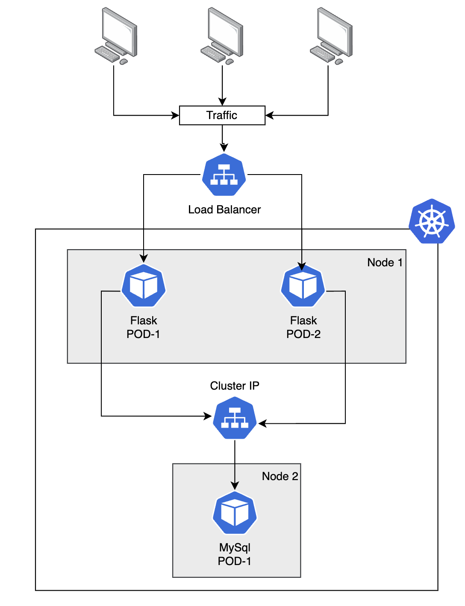
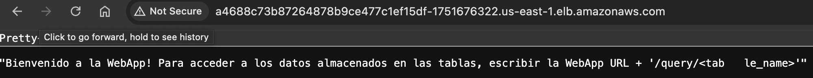
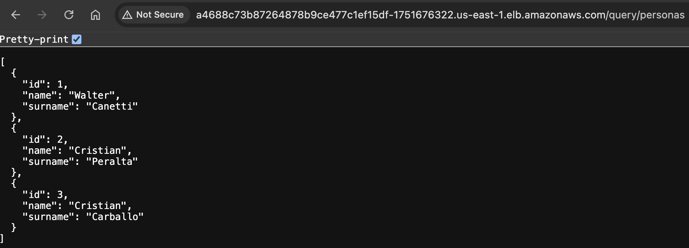
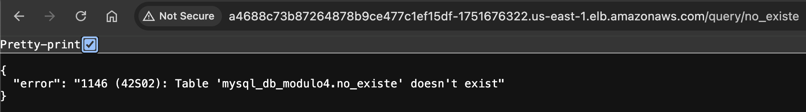

# Entrega 2 - Trabajo Integrador de Kubernetes

---

## Descripción

Este proyecto es parte del curso **Docker y Kubernetes (2024)** de la **UTNBA**. En esta actividad, se ha desplegado en un cluster de kubernetes, utilizando el servicio administrado de AWS, llamado Amazon Elastic Kubernetes Service (Amazon EKS).

---

## Arquitectura de Solución

La aplicación desplegada en el cluster de Kubernetes permite acceder a los datos persistidos en una base de datos MySQL. 

Para el Front End, se desplegó el servicio **"flask-service"**, el cual contiene permite el acceso público a través de un Load Balancer (*type: LoadBalancer*).

En lo que respecto al acceso a la base de datos MySQL, se desplegó un el servicio **mysql-service**, el cual permite el enrrutamiento interno en el cluster de Kubernetes (*ClusterIP*). De esta manera es habilitada la comunicación entre los pods de flask y la base de datos.

---

## Testeo de la aplicación

La aplicación se encuentra desplegada en Amazon EKS y puede ser accedida via HTTP sobre el siguiente link:

http://a4688c73b87264878b9ce477c1ef15df-1751676322.us-east-1.elb.amazonaws.com/

http://a4688c73b87264878b9ce477c1ef15df-1751676322.us-east-1.elb.amazonaws.com/query/personas

http://a4688c73b87264878b9ce477c1ef15df-1751676322.us-east-1.elb.amazonaws.com/query/no_existe

